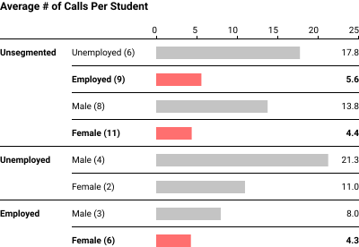

## Context
**Data visualizations about who my students are**
Students from wide variety of professional backgrounds, stages of life:

Greatly different strengths and interests
**Curriculum visualization**

## Desired Outcome
Be able to set students up for success regardless of which direction they take their UX skillset.

## Process Taken
Continually expanding my call repertoire.
To date - September to May - X# of calls and X# of portfolio reviews

Pre-Mortem
Difficulty / Impact Matrix
Career Reflection
UX Career Paths
Whiteboard exercises
Copy Work
UI Design principles
Go over exercises

Continually upskilled, myself:
  - Cognitive Biases
  - Innovation Techniques

Call menu:

## Actual Outcomes
2x number of scheduled mentor calls
**Data visualizations**

## Personal Reflection
?
